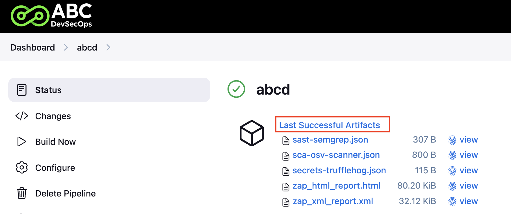
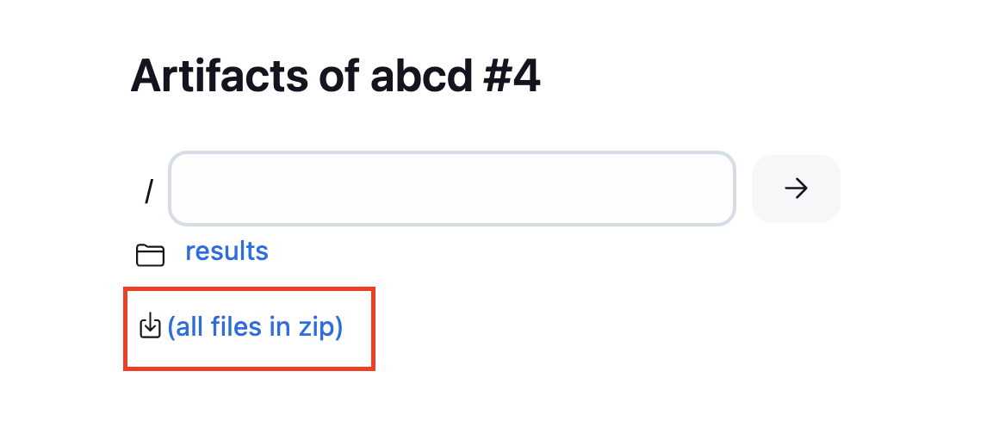

# Uruchomienie pipeline i wysyłanie wyników (zadań)

Będąc na stronie startowej [Dashboard](http://localhost:8080/) kliknij "New item", nazwij swój pipeline według uznania (**UWAGA! Nazwa pipeline nie może zawierać spacji, inaczej będzies zmiał potem problem z kopiowaniem artefaktów**). Jako typ projektu wybierz "Pipeline" i kliknij "Ok".


Wybierz na samym dole **"Pipeline script from SCM"** jako repozytorium podaj adres (po HTTPS) do swojego zforkowanego repozytorium a jako "Credentials" wskaż wcześniej utworzone dane uwierzytelniające zawierają GitHub PAT. Jako ścieżka do Jenkinsfile zostaw po prostu `Jenkinsfile`. Zatwierdź i zapisz zmiany.

W tym momencie przejdź do zforkowanego repozytorium i w pliku deklarującym Twój pipeline `Jenkinsfile` upewnij się, że w kroku `git` masz ustawione odpowiednie wartości:
* credentialsId
* url
* branch

```Jenkinsfile
pipeline {
    agent any
    options {
        skipDefaultCheckout(true)
    }
    stages {
        stage('Code checkout from GitHub') {
            steps {
                script {
                    cleanWs()
                    git credentialsId: 'github-pat', url: 'https://github.com/johndoe/abcd-student', branch: 'main'
                }
            }
        }
        stage('Example') {
            steps {
                echo 'Hello!'
                sh 'ls -la'
            }
        }
    }
}
```
Do pisania pipeline wykorzystuj [declarative syntax](https://www.jenkins.io/doc/book/pipeline/syntax/#declarative-pipeline), który jest bardziej przejrzysty i prostszy.

Po ustawieniu odpowiednich wartości (upewnij się, że zacommitowałeś zmiany do zdalnego repozytorium) możesz uruchomić pipeline za pomocą "Build now". Pierwsze uruchomienie zklonuje repozytorium do przestrzeni roboczej i wykona stage "Example", w którym robimy proste `echo` oraz listujemy zawartość bieżącego katalogu.


## Wysyłanie wyników do certyfikatu

Aby uzyskać certyfikat ukończenia szkolenia ABC DevSecOps musisz wygenerować **4 artefakty dla praktyk omawianych w kursie**. Artefekty będą generowane ze skanów przeprowadzonych dla Twojego zforkowanego repozytorium z aplikacją Juice Shop.

| Narzędzie              | Format   | Praktyka      |
|------------------------|----------|---------------|
| Zed Attack Proxy (ZAP) | XML/HTML | DAST          |
| OSV-Scanner            | JSON     | SCA           |
| TruffleHog             | JSON     | Sekrety       |
| Semgrep                | JSON     | SAST          |

Artefakty ze skanów możesz zapisywać na przykład w katalogu `results` po uprzednim utworzeniu go w pipeline.

Przykład:
```
...
        stage('SCA scan') {
            steps {
                sh 'osv-scanner scan --lockfile package-lock.json --format json --output results/sca-osv-scanner.json'
            }
        }
        post {
            always {
                echo 'Archiving results...'
                archiveArtifacts artifacts: 'results/**/*', fingerprint: true, allowEmptyArchive: true
        }
    }
...
```

Gdy wygenerujesz wszystkie artefakty możesz w prosty sposób z poziomu Jenkinsa pobrać je wszystkie spakowane w ZIPie.



Plik ze spakowanymi artefaktami zapisz na dysku, zmień nazwę na swoje imię i nazwisko np. `jan_kowalski.zip` i prześlij za pomocą formularza (link znajdziesz na platformie kursowej).
